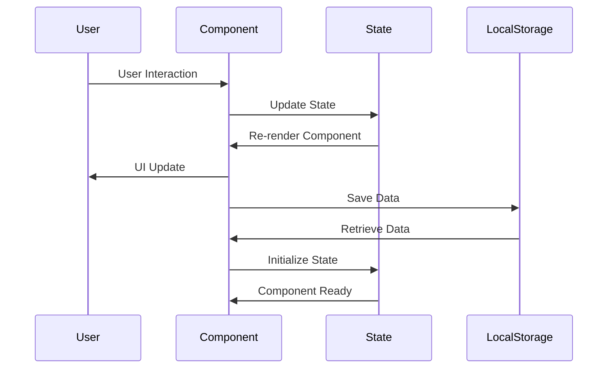
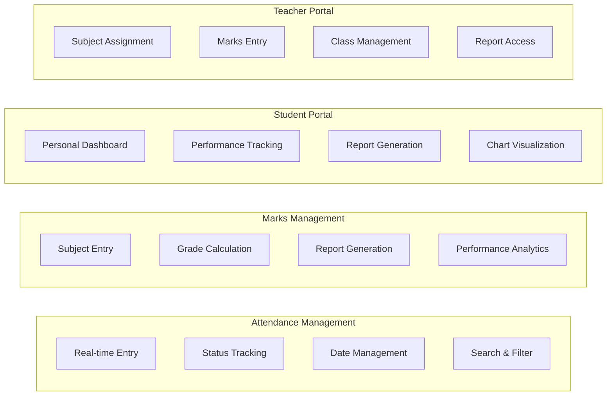

# System Architecture Diagram

## 🏗️ High-Level System Architecture

```mermaid
graph TB
    subgraph "Frontend Application"
        subgraph "Presentation Layer"
            UI[User Interface]
            Pages[Page Components]
            Forms[Form Components]
        end
        
        subgraph "Component Layer"
            Hero[HeroSection]
            Header[Header]
            Footer[Footer]
            Attendance[Attendance Module]
            Marks[Marks Module]
            Student[Student Module]
        end
        
        subgraph "State Management"
            LocalState[Local State]
            ReactHooks[React Hooks]
            DataCache[Data Cache]
        end
    end
    
    subgraph "Data Layer"
        LocalStorage[Local Storage]
        SessionData[Session Data]
        UserPrefs[User Preferences]
    end
    
    UI --> Pages
    Pages --> Forms
    Forms --> Component Layer
    Component Layer --> State Management
    State Management --> Data Layer
```

## 📱 Component Architecture

```mermaid
graph LR
    subgraph "Core Components"
        App[App.jsx]
        Main[main.jsx]
    end
    
    subgraph "Page Components"
        Starter[Starter.jsx]
        Student[Student.jsx]
        ChatHelp[ChatHelp.jsx]
    end
    
    subgraph "Feature Modules"
        subgraph "Attendance"
            AForm[AttendanceForm.js]
            ADisplay[AttendanceDisplay.js]
        end
        
        subgraph "Marks Report"
            MForm[MarksForm.js]
            MReport[MarksReport.js]
            TLogin[TeacherLogin.js]
        end
        
        subgraph "Student Review"
            SLogin[StudentLogin.js]
            SDashboard[StudentDashboard.js]
            SReport[StudentReport.js]
        end
    end
    
    subgraph "Shared Components"
        Hero[HeroSection.jsx]
        Header[Header.jsx]
        Footer[Footer.jsx]
    end
    
    App --> Starter
    App --> Student
    App --> ChatHelp
    
    Starter --> Hero
    Student --> Student Review
    ChatHelp --> Shared Components
    
    Attendance --> Shared Components
    Marks Report --> Shared Components
    Student Review --> Shared Components
```

## 🔄 Data Flow Architecture



## 🎨 Design System Architecture

```mermaid
graph TB
    subgraph "Design System"
        subgraph "Color Palette"
            Primary[Emerald & Teal]
            Secondary[Slate Grays]
            Accent[Status Colors]
        end
        
        subgraph "Typography"
            Headings[Bold Headings]
            Body[Clean Body Text]
            Labels[Form Labels]
        end
        
        subgraph "Layout"
            Cards[Card Design]
            Grid[Grid System]
            Spacing[Consistent Spacing]
        end
    end
    
    subgraph "Components"
        Forms[Form Components]
        Tables[Table Components]
        Charts[Chart Components]
        Buttons[Button Components]
    end
    
    Design System --> Components
```

## 🛠️ Technology Stack

```mermaid
graph TB
    subgraph "Frontend Framework"
        React[React 19.1.0]
        Vite[Vite 7.0.0]
        ReactDOM[React DOM 19.1.0]
    end
    
    subgraph "Styling"
        Tailwind[Tailwind CSS 4.1.11]
        Custom[Custom Design System]
        Responsive[Responsive Design]
    end
    
    subgraph "Development Tools"
        ESLint[ESLint 9.29.0]
        TypeScript[TypeScript Support]
        HMR[Hot Module Replacement]
    end
    
    subgraph "UI Components"
        Lucide[Lucide React 0.525.0]
        CustomComps[Custom Components]
    end
    
    Frontend Framework --> Styling
    Styling --> Development Tools
    Development Tools --> UI Components
```

## 📊 Feature Modules



## 🔐 Security Architecture

```mermaid
graph TB
    subgraph "Authentication"
        Login[Login System]
        Roles[Role-based Access]
        Session[Session Management]
    end
    
    subgraph "Data Protection"
        Validation[Input Validation]
        ErrorHandling[Error Management]
        DataIntegrity[Data Integrity]
    end
    
    subgraph "User Isolation"
        TeacherData[Teacher Data]
        StudentData[Student Data]
        AdminData[Admin Data]
    end
    
    Authentication --> Data Protection
    Data Protection --> User Isolation
```

## 📱 Responsive Design

```mermaid
graph LR
    subgraph "Breakpoints"
        Mobile[320px+]
        Tablet[768px+]
        Desktop[1024px+]
        Large[1280px+]
    end
    
    subgraph "Adaptive Features"
        Flexible[Flexible Grids]
        Touch[Touch-friendly]
        Typography[Scalable Text]
    end
    
    subgraph "Layout Patterns"
        Cards[Card Layout]
        Grid[Grid System]
        Navigation[Responsive Nav]
    end
    
    Breakpoints --> Adaptive Features
    Adaptive Features --> Layout Patterns
```

## 🚀 Performance Architecture

```mermaid
graph TB
    subgraph "Build Optimization"
        Vite[Vite Bundling]
        CodeSplit[Code Splitting]
        TreeShake[Tree Shaking]
    end
    
    subgraph "Runtime Performance"
        Hooks[React Hooks]
        Memo[useMemo]
        Rendering[Optimized Rendering]
    end
    
    subgraph "State Management"
        LocalState[Local State]
        Props[Props Drilling]
        Events[Event Handling]
    end
    
    Build Optimization --> Runtime Performance
    Runtime Performance --> State Management
```

---

## 📋 Key Architecture Principles

### 1. **Modularity**
- Independent feature modules
- Clear separation of concerns
- Reusable components

### 2. **Scalability**
- Component-based architecture
- Extensible design system
- Future-ready structure

### 3. **Performance**
- Optimized rendering
- Efficient state management
- Fast build times

### 4. **Maintainability**
- Clean code structure
- Consistent patterns
- Clear documentation

### 5. **User Experience**
- Responsive design
- Intuitive interfaces
- Fast interactions 